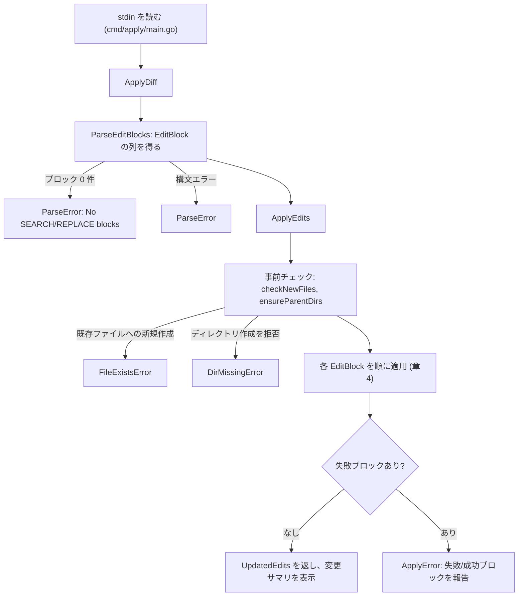
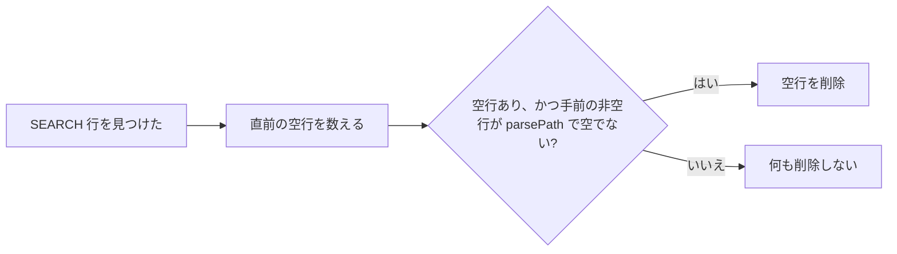
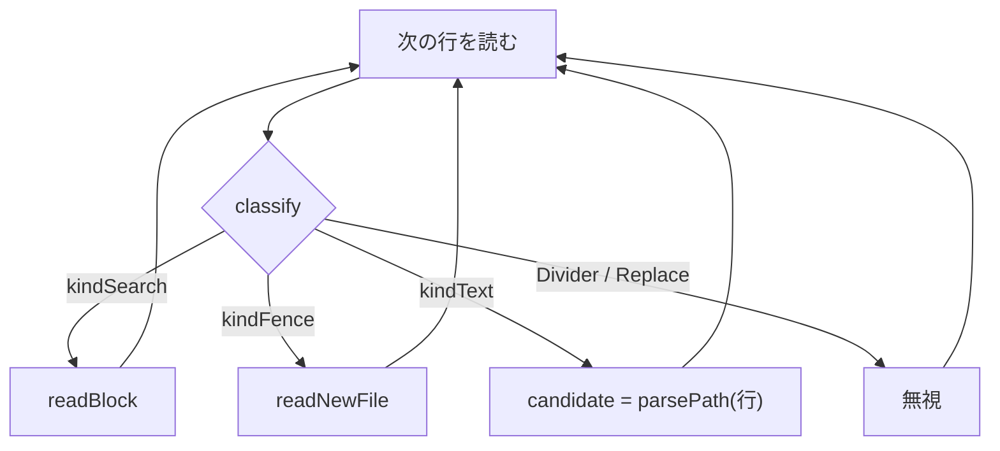
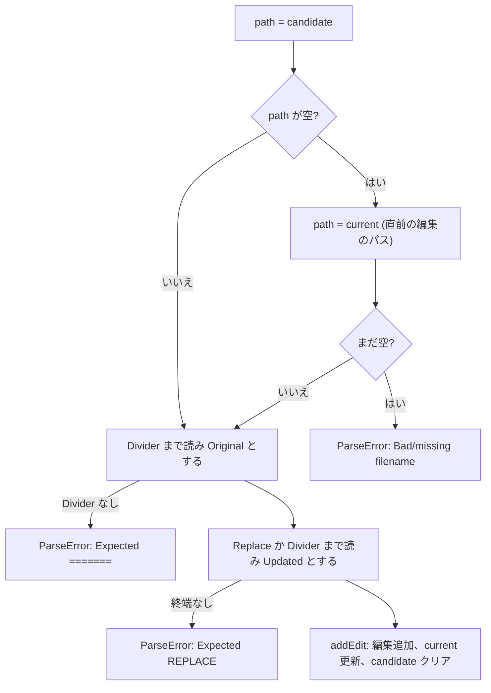
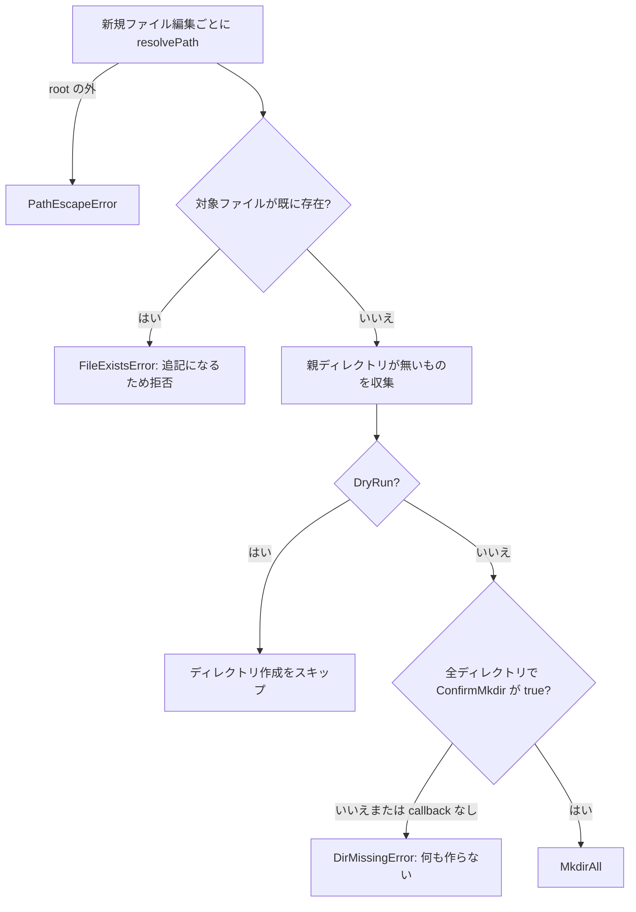
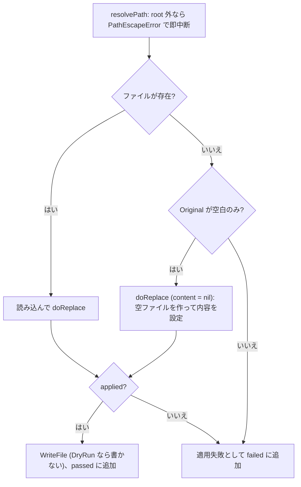
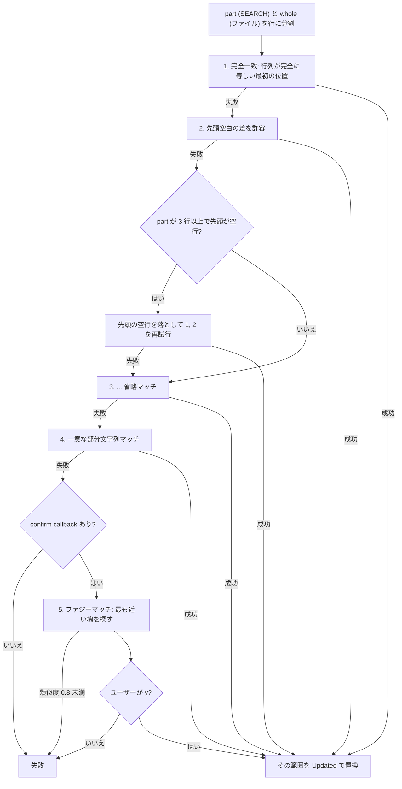
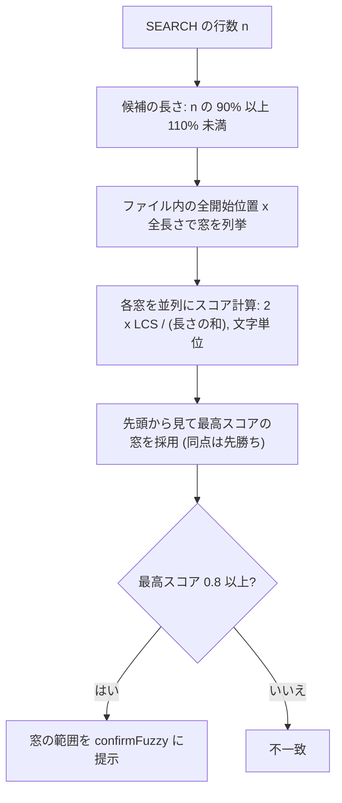

# apply (search-replace-go)

A Go implementation of Aider's SEARCH/REPLACE ("editblock") diff format. It parses SEARCH/REPLACE blocks out of an LLM's response and applies them to files on disk, using the same matching strategies (exact match, whitespace-tolerant match, `...`-elided match, unique-substring match, and fuzzy match) as the original [search-replace-py](https://github.com/marcius-llmus/search-replace-py) library.

## Repository layout

- `edit/` — the core Go package.
  - `parser.go` — finds and parses `<<<<<<< SEARCH` / `=======` / `>>>>>>> REPLACE` blocks, including filename discovery.
  - `apply.go` — applies parsed edits to files, with exact, whitespace-tolerant, and `...`-elided matching.
  - `fuzzy.go` — last-resort fuzzy matching and "did you mean" suggestions for failed matches.
  - `types.go` / `errors.go` — shared types and error types (`ParseError`, `PathEscapeError`, `ApplyError`).
- `cmd/apply/` — CLI entrypoint (`apply`) built on top of `edit`.

## Build & install

```bash
make build     # builds ./apply
make install   # go install ./cmd/apply
```

## Usage

Pipe an LLM's diff response into `apply`. The diff must contain the filename on the line before each SEARCH block; `apply` takes no arguments other than `-h` / `--help` (running it without piped input also prints the help):

```bash
wl-paste | apply
```

A SEARCH/REPLACE block looks like:

```
mathweb/flask/app.py
<<<<<<< SEARCH
from flask import Flask
=======
import math
from flask import Flask
>>>>>>> REPLACE
```


## Testing

```bash
make test   # gofmt check, go vet, build, go test ./...
```


# apply: SEARCH/REPLACE アルゴリズムとルール適用の全体像

`apply` は LLM の応答(stdin)から SEARCH/REPLACE ブロックを取り出し、ディスク上のファイルへ適用する CLI です。処理は大きく **パース → 事前チェック → 1 ブロックずつ適用 → 結果/エラー報告** の 4 段階です。

## 1. 全体フロー



## 2. パース (`edit/parser.go`)

### 2.1 行の分類

各行は `classify` で 5 種類に分けられます。前後の空白は無視して判定します。

| kind | 判定 |
| --- | --- |
| `kindSearch` | `<<<<<<< SEARCH` (`<` が 5〜9 個) |
| `kindDivider` | `=======` (`=` が 5〜9 個) |
| `kindReplace` | `>>>>>>> REPLACE` (`>` が 5〜9 個) |
| `kindFence` | フェンス(```` ``` ````)で始まる行 |
| `kindText` | 上記以外(散文、パス行、コード本文) |

### 2.2 前処理: パスと SEARCH の間の空行を除去

パース前に `dropBlankLinesBeforeSearch` を通します。`SEARCH` 行の直前にある空行は、**その手前の非空行がパス行のときだけ**削除します。これでパス行と SEARCH 行が空行で隔てられていても、隣り合っている場合と同じに扱えます。



フェンスの前の空行は削除しません(パスが無効になる仕様のまま)。

さらにその前に `unwrapFencedPaths` を通します。パス行だけが素のフェンスで囲まれ(フェンス、パス、フェンス)、直後に新規ファイル本文のフェンスか SEARCH 行が続く場合は、囲みの 2 行を削除します。直前の行がパス行のときは、新規ファイル本文とみなして触りません。

### 2.3 状態機械

`blockParser` は `candidate`(直前行のパス)と `current`(最後に使ったパス)を持ちます。



- 本文・空行は `kindText` なので `candidate` を上書きします。パスらしくなければ `""` になります。つまり**パスはブロックまたはフェンスの直前行にあるときだけ有効**です。
- フェンス行自体は `candidate` を変えないため、「パス → フェンス → SEARCH」でもパスが引き継がれます。

### 2.4 readBlock



同じファイルへの連続ブロックは、2 つ目以降のパスを省略しても `current` で補われます。

### 2.5 readNewFile(新規ファイル)

パス行の直後にフェンスがあり、その次の行が SEARCH でなければ、フェンス内全体を新規ファイルの内容とみなします(`Original` は空文字)。

- パス末尾の `(new file)` / `（新規）` などの注記、`**` や `` ` `` の装飾、末尾の `:` は `parsePath` が取り除きます。
- パスが無いフェンス(例示コードなど)は無視されます。
- `parsePath` は、空白を含まず `.` か `/` を含む文字列だけをパスと認めます。

## 3. 事前チェック (`ApplyEdits` の冒頭)

**何も書き込む前に**、新規ファイル編集(`Original` が空白のみ)だけを対象に検査します。



ディレクトリは**全件の確認が済んでから**まとめて作るので、拒否した場合ディスクは変わりません。

## 4. 1 ブロックの適用

### 4.1 ファイル単位の分岐



### 4.2 doReplace

1. `stripQuotedWrapping` で、SEARCH/REPLACE 本文に紛れ込んだ「ファイル名行」と「フェンスの囲み」を除去します(フェンスは先頭と末尾の 2 行が揃っているときだけ)。
2. `Original` が空白のみなら、ファイル末尾に `Updated` を連結します。
3. そうでなければ `replaceMostSimilarChunk` を呼びます。

### 4.3 マッチ戦略のカスケード

`replaceMostSimilarChunk` は、上から順に試して**最初に成功したものを採用**します。



| # | 戦略 | 概要 |
| --- | --- | --- |
| 1 | 完全一致 | 行単位で完全一致する最初の箇所を置換。 |
| 2 | 先頭空白許容 | SEARCH/REPLACE 双方の共通インデントを外し、ファイル側の窓と「先頭空白を除いて一致」するか確認。ファイル側のインデント接頭辞が窓内の全行で同一のときだけ、その接頭辞を REPLACE の各行へ付け直す。 |
| 3 | `...` 省略 | `...` だけの行で SEARCH/REPLACE を分割し、各チャンクがファイル内でちょうど 1 回出現する場合のみ順に置換。`...` の数や位置が両者で食い違う場合は不採用。 |
| 4 | 一意部分文字列 | 行頭以外から始まる SEARCH 用。末尾改行を除いた文字列がファイル内にちょうど 1 回出現するときだけ置換。複数なら曖昧なので失敗。 |
| 5 | ファジー | ユーザー確認が取れた場合だけ適用。 |

### 4.4 ファジーマッチ (`edit/fuzzy.go`)



## 5. エラー報告

失敗ブロックが 1 つでもあると `ApplyError` を返します。メッセージには次が含まれます。

- 失敗ブロックごとの SEARCH/REPLACE の内容
- `findSimilarLines` による「Did you mean...?」(類似度 0.6 以上のとき。先頭行と末尾行が一致すれば該当範囲のみ、そうでなければ前後 5 行付き)
- REPLACE 側が既にファイルにある場合の「Are you sure...?」
- 成功済みブロックがあるときは「再送不要、失敗分だけ直して」という案内(DryRun のときは「適用できる」という表現に変わる)

## 6. エラー型一覧

| 型 | 発生箇所 | 意味 |
| --- | --- | --- |
| `ParseError` | パース | 構文不正、パス欠落、ブロック 0 件 |
| `PathEscapeError` | `resolvePath` | 編集先が root の外 |
| `FileExistsError` | 事前チェック | 新規作成の対象が既存 |
| `DirMissingError` | 事前チェック | 親ディレクトリが無く、作成が承認されなかった |
| `ApplyError` | 適用 | 1 つ以上の SEARCH が一致しなかった |

## 7. 書き込みの粒度に関する注意点

- **事前チェックは全か無か**: ここで失敗すれば何も書かれません。
- **適用は 1 ブロックずつ書き込み**: 成功したブロックはその場でディスクに反映され、失敗ブロックだけが `ApplyError` に残ります。同じファイルへの複数ブロックは、更新済みの内容に対して順に適用されます。
- **`PathEscapeError` は途中で即中断**: それまでに成功したブロックは書き込み済みです。
- **DryRun では書き込まない**: そのため同一ファイルへの 2 つ目以降のブロックは、1 つ目が反映されていないファイル内容に対して検証されます。
